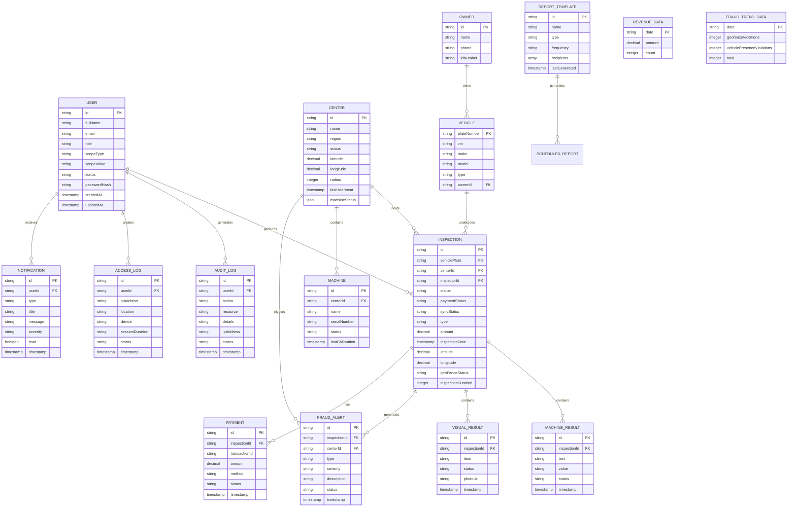

# VIMS Admin Portal - Database Schema & ER Diagram

## Overview
This document describes the Entity-Relationship (ER) model and data structures for the Vehicle Inspection Management System (VIMS) Admin Portal based on the current implementation.

---

## Entity-Relationship Diagram



---

## Entity Descriptions

### 1. USER
**Purpose**: Manages system users with role-based access control and regional scoping.

| Attribute | Type | Constraints | Description |
|-----------|------|-------------|-------------|
| id | String (UUID) | PK, Required | Unique user identifier |
| fullName | String | Required | User's full name |
| email | String | Required, Unique | User email address |
| role | Enum | Required | Role: Super Admin, Regional Admin, Inspector, Viewer |
| scopeType | Enum | Required | Scope level: National, Regional, Center |
| scopeValue | String | Required | Specific region or center ID |
| status | Enum | Required | Account status: Active, Suspended |
| passwordHash | String | Required | Encrypted password |
| createdAt | Timestamp | Required | Account creation date |
| updatedAt | Timestamp | Required | Last update timestamp |

**Relationships**:
- One-to-Many with INSPECTION (performs inspections)
- One-to-Many with AUDIT_LOG (generates audit entries)
- One-to-Many with ACCESS_LOG (creates access sessions)
- One-to-Many with NOTIFICATION (receives notifications)

---

### 2. CENTER
**Purpose**: Represents inspection centers with geofencing and machine monitoring.

| Attribute | Type | Constraints | Description |
|-----------|------|-------------|-------------|
| id | String | PK, Required | Unique center identifier (e.g., CTR-001) |
| name | String | Required | Center name |
| region | String | Required | Geographic region |
| status | Enum | Required | Online, Offline, Syncing |
| latitude | Decimal(10,6) | Required | GPS latitude for geofence |
| longitude | Decimal(10,6) | Required | GPS longitude for geofence |
| radius | Integer | Required | Geofence radius in meters |
| lastHeartbeat | Timestamp | Required | Last connectivity check |
| machineStatus | JSON | Required | Array of machine statuses |

**Relationships**:
- One-to-Many with INSPECTION (hosts inspections)
- One-to-Many with MACHINE (contains machines)
- One-to-Many with FRAUD_ALERT (triggers alerts)

---

### 3. VEHICLE
**Purpose**: Stores vehicle information and registration details.

| Attribute | Type | Constraints | Description |
|-----------|------|-------------|-------------|
| plateNumber | String | PK, Required | Vehicle license plate (e.g., ET 12345A) |
| vin | String | Required, Unique | Vehicle Identification Number |
| make | String | Required | Manufacturer (e.g., Toyota) |
| model | String | Required | Vehicle model (e.g., Hiace) |
| type | String | Required | Vehicle type: Passenger Car, Mini Bus, Truck, etc. |
| ownerId | String (UUID) | FK, Required | Reference to OWNER |

**Relationships**:
- Many-to-One with OWNER (owned by)
- One-to-Many with INSPECTION (undergoes inspections)

---

### 4. OWNER
**Purpose**: Stores vehicle owner information.

| Attribute | Type | Constraints | Description |
|-----------|------|-------------|-------------|
| id | String (UUID) | PK, Required | Unique owner identifier |
| name | String | Required | Owner full name |
| phone | String | Required | Contact phone number |
| idNumber | String | Required | National ID number |

**Relationships**:
- One-to-Many with VEHICLE (owns vehicles)

---

### 5. INSPECTION
**Purpose**: Core entity representing a vehicle inspection record.

| Attribute | Type | Constraints | Description |
|-----------|------|-------------|-------------|
| id | String | PK, Required | Unique inspection ID (e.g., VIS-2025-0023) |
| vehiclePlate | String | FK, Required | Reference to VEHICLE |
| centerId | String | FK, Required | Reference to CENTER |
| inspectorId | String (UUID) | FK, Required | Reference to USER (inspector) |
| status | Enum | Required | Passed, Failed, Pending |
| paymentStatus | Enum | Required | Paid, Pending |
| syncStatus | Enum | Required | Synced, Pending |
| type | String | Required | Initial Inspection, Re-inspection |
| amount | Decimal(10,2) | Required | Inspection fee amount |
| inspectionDate | Timestamp | Required | Date and time of inspection |
| latitude | Decimal(10,6) | Required | GPS latitude where inspection occurred |
| longitude | Decimal(10,6) | Required | GPS longitude where inspection occurred |
| geoFenceStatus | Enum | Required | Valid, Invalid, Unknown |
| inspectionDuration | Integer | Optional | Duration in minutes |

**Relationships**:
- Many-to-One with VEHICLE (inspection for vehicle)
- Many-to-One with CENTER (performed at center)
- Many-to-One with USER (performed by inspector)
- One-to-Many with MACHINE_RESULT (contains test results)
- One-to-Many with VISUAL_RESULT (contains visual checks)
- One-to-One with PAYMENT (has payment record)
- One-to-Many with FRAUD_ALERT (may generate alerts)

---

### 6. MACHINE_RESULT
**Purpose**: Stores results from automated machine tests.

| Attribute | Type | Constraints | Description |
|-----------|------|-------------|-------------|
| id | String (UUID) | PK, Required | Unique result identifier |
| inspectionId | String | FK, Required | Reference to INSPECTION |
| test | String | Required | Test type: Brakes, Emissions, Suspension, Headlights |
| value | String | Required | Test result value (e.g., "78%", "2.1%") |
| status | Enum | Required | Pass, Fail |
| timestamp | Timestamp | Required | When test was performed |

**Relationships**:
- Many-to-One with INSPECTION (belongs to inspection)

---

### 7. VISUAL_RESULT
**Purpose**: Stores visual inspection checklist items with evidence photos.

| Attribute | Type | Constraints | Description |
|-----------|------|-------------|-------------|
| id | String (UUID) | PK, Required | Unique visual result identifier |
| inspectionId | String | FK, Required | Reference to INSPECTION |
| item | String | Required | Checklist item: Tires, Windshield, Mirrors, Lights, Body Damage |
| status | Enum | Required | Pass, Fail |
| photoUrl | String | Optional | URL to evidence photo |
| timestamp | Timestamp | Required | When visual check was performed |

**Relationships**:
- Many-to-One with INSPECTION (belongs to inspection)

---

### 8. PAYMENT
**Purpose**: Tracks payment transactions for inspections.

| Attribute | Type | Constraints | Description |
|-----------|------|-------------|-------------|
| id | String (UUID) | PK, Required | Unique payment identifier |
| inspectionId | String | FK, Required | Reference to INSPECTION |
| transactionId | String | Optional | External payment gateway transaction ID |
| amount | Decimal(10,2) | Required | Payment amount |
| method | String | Required | Payment method: Telebirr, Cash, etc. |
| status | Enum | Required | Paid, Pending, Failed |
| timestamp | Timestamp | Required | Payment timestamp |

**Relationships**:
- One-to-One with INSPECTION (payment for inspection)

---

### 9. FRAUD_ALERT
**Purpose**: Records fraud detection alerts and violations.

| Attribute | Type | Constraints | Description |
|-----------|------|-------------|-------------|
| id | String | PK, Required | Unique alert identifier (e.g., alert-001) |
| inspectionId | String | FK, Required | Reference to INSPECTION |
| centerId | String | FK, Required | Reference to CENTER |
| type | Enum | Required | Geofence Violation, Vehicle Presence Violation, Machine Mismatch, Duplicate Inspection |
| severity | Enum | Required | High, Medium, Low |
| description | String | Required | Detailed description of violation |
| status | Enum | Required | Open, Resolved |
| timestamp | Timestamp | Required | When alert was generated |

**Relationships**:
- Many-to-One with INSPECTION (generated from inspection)
- Many-to-One with CENTER (related to center)

---

### 10. NOTIFICATION
**Purpose**: In-app notifications for users.

| Attribute | Type | Constraints | Description |
|-----------|------|-------------|-------------|
| id | String (UUID) | PK, Required | Unique notification identifier |
| userId | String (UUID) | FK, Optional | Target user (null for broadcast) |
| type | Enum | Required | geofence, vehicle_presence, system, info |
| title | String | Required | Notification title |
| message | String | Required | Notification message |
| severity | Enum | Required | high, medium, low |
| read | Boolean | Required, Default: false | Read status |
| timestamp | Timestamp | Required | When notification was created |

**Relationships**:
- Many-to-One with USER (received by user)

---

### 11. AUDIT_LOG
**Purpose**: Comprehensive audit trail of all system actions.

| Attribute | Type | Constraints | Description |
|-----------|------|-------------|-------------|
| id | String | PK, Required | Unique log identifier (e.g., log-001) |
| userId | String (UUID) | FK, Optional | User who performed action |
| action | String | Required | Action type: User Created, Configuration Updated, etc. |
| resource | String | Required | Resource affected: User Management, Test Standards, etc. |
| details | String | Required | Detailed description |
| ipAddress | String | Required | IP address of user |
| status | Enum | Required | Success, Failed |
| timestamp | Timestamp | Required | When action occurred |

**Relationships**:
- Many-to-One with USER (performed by user)

---

### 12. ACCESS_LOG
**Purpose**: Tracks user login sessions and access history.

| Attribute | Type | Constraints | Description |
|-----------|------|-------------|-------------|
| id | String | PK, Required | Unique access log identifier |
| userId | String (UUID) | FK, Required | Reference to USER |
| ipAddress | String | Required | IP address of session |
| location | String | Required | Geographic location (e.g., "Addis Ababa, Ethiopia") |
| device | String | Required | Device/browser info (e.g., "Chrome on Windows") |
| sessionDuration | String | Required | Session duration (e.g., "2h 15m") |
| status | Enum | Required | Active, Ended |
| timestamp | Timestamp | Required | Session start time |

**Relationships**:
- Many-to-One with USER (session for user)

---

### 13. REPORT_TEMPLATE
**Purpose**: Scheduled report configurations.

| Attribute | Type | Constraints | Description |
|-----------|------|-------------|-------------|
| id | String | PK, Required | Unique template identifier |
| name | String | Required | Report name |
| type | Enum | Required | Revenue, Inspection, Regional, Fraud |
| frequency | Enum | Required | Daily, Weekly, Monthly |
| recipients | Array[String] | Required | List of email addresses |
| lastGenerated | Timestamp | Required | Last report generation time |

---

### 14. REVENUE_DATA
**Purpose**: Aggregated revenue statistics.

| Attribute | Type | Constraints | Description |
|-----------|------|-------------|-------------|
| date | Date | PK, Required | Date of revenue |
| amount | Decimal(10,2) | Required | Total revenue amount |
| count | Integer | Required | Number of inspections |

---

### 15. FRAUD_TREND_DATA
**Purpose**: Aggregated fraud violation trends.

| Attribute | Type | Constraints | Description |
|-----------|------|-------------|-------------|
| date | Date | PK, Required | Date of violations |
| geofenceViolations | Integer | Required | Count of geofence violations |
| vehiclePresenceViolations | Integer | Required | Count of vehicle presence violations |
| total | Integer | Required | Total violations |

---

## Key Relationships Summary

1. **USER → INSPECTION**: One user (inspector) can perform many inspections
2. **CENTER → INSPECTION**: One center can host many inspections
3. **VEHICLE → INSPECTION**: One vehicle can have many inspections over time
4. **INSPECTION → MACHINE_RESULT**: One inspection has multiple machine test results
5. **INSPECTION → VISUAL_RESULT**: One inspection has multiple visual checklist items
6. **INSPECTION → FRAUD_ALERT**: One inspection can generate multiple fraud alerts
7. **USER → NOTIFICATION**: One user can receive many notifications
8. **USER → AUDIT_LOG**: One user can generate many audit log entries

---

## Data Flow

```
USER (Inspector)
    ↓
INSPECTION (Created)
    ↓
    ├─→ MACHINE_RESULT (Automated tests)
    ├─→ VISUAL_RESULT (Manual checks with photos)
    ├─→ PAYMENT (Transaction)
    └─→ FRAUD_ALERT (If violations detected)
            ↓
        NOTIFICATION (Alert sent to admins)
```

---

## Security & Access Control

### Role-Based Access Control (RBAC)
- **Super Admin**: Full system access, all regions
- **Regional Admin**: Access limited to assigned region
- **Inspector**: Access limited to assigned center
- **Viewer**: Read-only access, no PII viewing

### Scope-Based Filtering
- **National Scope**: Access to all data
- **Regional Scope**: Access limited to specific region
- **Center Scope**: Access limited to specific center

---

## Fraud Detection Logic

### Geofence Violation Detection
- Calculates distance between inspection location and center coordinates
- Compares against center's defined radius
- Triggers alert if distance > radius

### Vehicle Presence Violation Detection
- Checks for missing visual inspection photos (< 3 photos)
- Checks for missing machine test results
- Checks for suspiciously quick inspection duration (< 5 minutes)
- Checks for invalid geofence status

---

## Indexes Recommended

1. **INSPECTION**: Index on `inspectionDate`, `vehiclePlate`, `centerId`, `status`
2. **USER**: Index on `email`, `role`, `scopeType`
3. **FRAUD_ALERT**: Index on `timestamp`, `status`, `severity`
4. **AUDIT_LOG**: Index on `timestamp`, `userId`, `action`
5. **NOTIFICATION**: Index on `userId`, `read`, `timestamp`

---

## Notes

- All timestamps are stored in UTC (ISO 8601 format)
- GPS coordinates use decimal degrees (WGS84)
- Monetary values are stored in ETB (Ethiopian Birr)
- Photo URLs can be local storage paths or external URLs
- Machine status is stored as JSON array for flexibility

